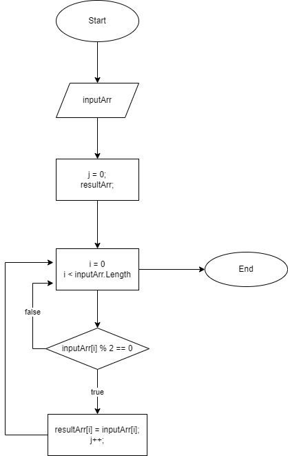
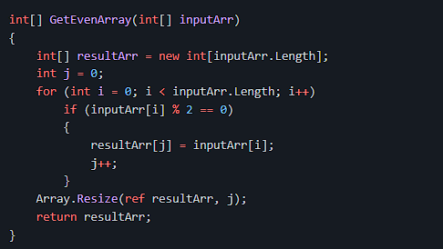

# **Итоговая контрольная работа**

## **Блок-схема**

### **Задача:** Написать программу, которая из имеющегося массива строк формирует новый массив из строк, длина которых меньше, либо равна 3 символам. Первоначальный массив можно ввести с клавиатуры, либо задать на старте выполнения алгоритма. При решении не рекомендуется пользоваться коллекциями, лучше обойтись исключительно массивами.

### **Примеры:**

[“Hello”, “2”, “world”, “:-)”] → [“2”, “:-)”]

[“1234”, “1567”, “-2”, “computer science”] → [“-2”]

[“Russia”, “Denmark”, “Kazan”] → []

## **Решение**

### **Для решения задачи были созданы следующие функции:**

* *FillArray* для заполнения массива;

* *PrintArray* для печати массива;

* *CountStringSymbols* для подсчета количества элементов в массиве, длина которых меньше либо равна 3 символа;

* *GenerateNewArray* для создания нового массива, состоящего из строк, длина которых меньше либо равна 3 символа.

**Алгоритм решения задачи:**

* Создаём массив;

* Наполняем массив строками (ввод в консоли);

* Производим подсчет количества элементов в массиве, длина которых меньше либо равна 3 символа;

* Создаем новый массив размером, равным количеству подсчитанных элементов;

* Наполняем новый массив элементами, длина которых меньше либо равна 3 символа;

* Выводим на печать исходный массив, символ "->" и новый массив.
